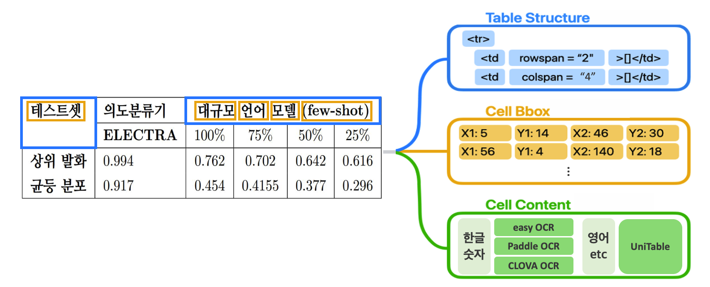

# [오케스트로] 한국어 표 인식을 위한 UniTable 활용

해당 프로젝트는 표(Table) 인식 분야의 SOTA모델인 UniTable을 한국어 데이터에 적용한 연구입니다. 
UniTable은 `표의 구조(Table Structure)`, `테두리 좌표(Bounding Box)`, `셀 내용(Cell Content)`을 동시에 예측하지만, 영어 기반 학습모델이라 한국어 처리에 한계가 있었습니다. 
특히, `셀 내용(Cell Content)`에서 한국어 인식 정확도가 낮아 이를 개선하기 위해 3가지의 한국어 OCR을 추가했습니다.

한국어 테이블 데이터셋의 부재의 한계에도 불구하고 영어 기반 SOTA모델의 한국어 확장 가능성을 탐구하고, 다국어 표 인식의 기반을 마련했다는 점에서 의의가 있습니다.

[notebook.ipynb](https://github.com/Boradori127/Table_Recognition/blob/master/notebook.ipynb) 파일을 실행하면 데모 확인이 가능합니다.

<br/>

## Model Architecture (모델 구조)



- Input: Table Image
- Output : Table Structure, Cell Bbox, Cell Content 
  * Table Structure: 표의 HTML 구조 정보 (rowspan, colspan 포함)
  * Bounding Box: 각 셀의 좌표값
  * Cell Content: 한국어 텍스트 및 숫자는 선택한 OCR 엔진으로 우선 인식. 영어 텍스트 및 OCR 미인식 셀은 UniTable 모델로 보완

<br/>


## Text Recognition Engine (텍스트 인식 엔진) 
각 OCR 엔진의 문자 인식 특성을 분석한 결과, 엔진별로 특정 문자 패턴에서 인식 한계를 보였습니다:

| **OCR 엔진**   | **인식 한계점**                 | **특성**                                   |
|----------------|--------------------------------|--------------------------------------------------|
| **EasyOCR**    | 특수문자(%, *) 미인식           | - 기본 문자 패턴 중심의 인식 알고리즘            <br>- 특수 문자에 대한 학습 데이터 부족             |
| **PaddleOCR**  | 구두점(점, 괄호) 미인식         | - 문자 세그멘테이션 기반 인식                    <br>- 작은 크기의 문자 패턴 검출 한계              |
| **CLOVA OCR**  | -                | - 계정 당 100회 이상 유료                 |


<br/>

## Dependencies (작업 환경)

- python >= 3.6
- torch == 2.2.0
- torchvision == 0.17.0
- torchtext == 0.17.0
- easyocr == 1.7.2
- paddleocr == 2.9.1


<br/>


## Install & Usage (설치 및 사용방법)
### 모델 가중치 다운로드

Hugging Face에서 가중치 파일을 다운로드:

```bash
$ wget -P weights/ https://huggingface.co/poloclub/UniTable/resolve/main/unitable_large_bbox.pt

$ wget -P weights/ https://huggingface.co/poloclub/UniTable/resolve/main/unitable_large_content.pt

$ wget -P weights/ https://huggingface.co/poloclub/UniTable/resolve/main/unitable_large_structure.pt
```

다운로드 링크: [UniTable Model Weights](https://huggingface.co/poloclub/UniTable/tree/main)

<br/>

### 테스트 데이터 (예시)

`./examples` 폴더에서 다음 테스트 데이터(예시) 를 확인할 수 있습니다:

- 영어 테이블: [PubTabNet](https://github.com/ibm-aur-nlp/PubTabNet)(표준 테이블 벤치마크)에서 추출
- 한국어 테이블: [HCLT 2023 한국어 정보처리 학회 논문집](http://www.hclt.kr/symp/?lnb=conference)기반 자체 제작
   *  한국어 테이블 5개(단순/복잡 구조), 한국어+영어 테이블 6개(단순/복잡 구조) 

<br/>

### 실행방법
영어 테이블:
```bash
$ CUDA_VISIBLE_DEVICES=0 python3 main.py --image_path {image_path} --gpu
```

한국어 포함 테이블:
- `ocr` 인자 지정 필수
  - 1 : EasyOCR / 2 : PaddleOCR / 3 : NaverClovaOCR
  - NaverClova OCR 사용할 경우 (계정 당 100회 무료) 
    - API 발급 후 `api_url`, `secret_key` 인자 지정 필수
```bash
$ CUDA_VISIBLE_DEVICES=0 python3 main.py --image_path {image_path} --gpu --korean --ocr {ocr_number} 
```


데모 실행:

[notebook.ipynb](https://github.com/Boradori127/Table_Recognition/blob/master/notebook.ipynb) 파일을 통해 빠른 테스트 가능


<br/>


## Updates

- 2024/12/27: Add Results


<br/>

## References
- [UniTable](https://github.com/poloclub/unitable)
- [EasyOCR](https://github.com/JaidedAI/EasyOCR)
- [PaddleOCR](https://github.com/PaddlePaddle/PaddleOCR)
- [CLOVA OCR](https://www.ncloud.com/product/aiService/ocr)